# Design Review Results: RAGAM – Full App

**Review Date**: 2026-03-01  
**Route**: All pages (`/`, `/library`, `/playlist/:id`, `/liked-songs`, `/downloads`, `/settings`)  
**Focus Areas**: Visual Design · UX/Usability · Responsive/Mobile · Accessibility · Micro-interactions/Motion · Consistency · Performance

> **Note**: This review was conducted through static code analysis only. Browser access was unavailable due to Electron plugin conflicts in the dev environment. Visual inspection via browser would provide additional insights into layout rendering, interactive behaviors, and actual appearance.

---

## Summary

RAGAM is a well-structured Electron-based music streaming app with a solid dark theme system, good use of shadcn/ui components, and thoughtful multi-source architecture (Spotify + YouTube Music). However, the app has **critical gaps in mobile navigation** (sidebar is hidden with no replacement), **accessibility issues** on icon-only buttons throughout, **hardcoded color values** that bypass the theme system, and **consistency problems** mixing raw `<button>` elements with shadcn `<Button>`. Several UX affordances (active nav state, search shortcut visibility) are also missing.

---

## Issues

| # | Issue | Criticality | Category | Location |
|---|-------|-------------|----------|----------|
| 1 | **No mobile navigation at all** — Sidebar is `hidden md:block` with no mobile bottom nav, hamburger menu, or any alternative navigation on small screens | 🔴 Critical | Responsive/Mobile | `src/components/Layout.tsx:28` |
| 2 | **Hardcoded Spotify green `#1DB954`** on Login button completely bypasses the multi-theme system — will be wrong color on KDON and MelloStudio themes | 🔴 Critical | Visual Design | `src/components/Header.tsx:99` |
| 3 | **No `aria-label` on any icon-only buttons** in Header (back, forward, settings) — screen readers announce nothing meaningful | 🔴 Critical | Accessibility | `src/components/Header.tsx:28-44, 53-59` |
| 4 | **No `aria-label` on Player icon buttons** (shuffle, prev, next, repeat, mute, lyrics, queue, video, download) | 🔴 Critical | Accessibility | `src/components/Player.tsx:700-1100` |
| 5 | **Missing `alt` attribute on video thumbnail ``** inside VideoModal — fails WCAG 1.1.1 | 🔴 Critical | Accessibility | `src/components/Player.tsx:269` |
| 6 | **No playlist virtualization** — rendering all tracks in a flat DOM list will freeze/lag for playlists with 500+ tracks | 🟠 High | Performance | `src/pages/Playlist.tsx:328-348` |
| 7 | **Sidebar has no active/current page indicator** — users can't tell which page they're on; no `aria-current="page"` on nav links | 🟠 High | UX/Usability | `src/components/Sidebar.tsx:54-92` |
| 8 | **`+` (Plus) button in sidebar has no functionality** — creates false affordance; renders but does nothing | 🟠 High | UX/Usability | `src/components/Sidebar.tsx:109-115` |
| 9 | **Search keyboard shortcut 'K' has no visual indicator** on the Search button — users won't discover it | 🟠 High | UX/Usability | `src/components/Sidebar.tsx:63-71` |
| 10 | **Empty `<h2>` rendered** when user is authenticated but viewing the playlists section heading — blank heading in DOM | 🟠 High | UX/Usability | `src/pages/Index.tsx:257-259` |
| 11 | **Hardcoded `bg-gray-800/50`** on playlist header image container — doesn't adapt to theme | 🟠 High | Visual Design | `src/pages/Playlist.tsx:261` |
| 12 | **Playlist "not found" state is bare plain text** with no icon, no action button, no visual affordance | 🟠 High | UX/Usability | `src/pages/Playlist.tsx:254-256` |
| 13 | **Playlist cover art fixed at `h-44 w-44`** — not responsive; could overflow on small screens, doesn't scale on large screens | 🟡 Medium | Responsive/Mobile | `src/pages/Playlist.tsx:260-268` |
| 14 | **Unused `.dark` theme in `index.css`** — Shadcn boilerplate dark theme (blue) is defined but never applied; conflicts conceptually with the custom dark default theme (green) | 🟡 Medium | Consistency | `src/index.css:68-104` |
| 15 | **Mixing raw `<button>` and shadcn `<Button>`** in the same files — inconsistent styling baseline, focus rings differ | 🟡 Medium | Consistency | `src/pages/Playlist.tsx:278-305`, `src/components/Player.tsx:243-325` |
| 16 | **Multiple border opacity conventions used** (`border-border/10`, `border-white/5`, `border-white/10`) — no single standard | 🟡 Medium | Consistency | `src/components/Layout.tsx:28,44`, `src/pages/Settings.tsx:280,415` |
| 17 | **Inconsistent icon sizing** — some use Tailwind classes (`h-5 w-5`), others use Lucide `size={28}` prop — no design token for icon sizes | 🟡 Medium | Consistency | `src/components/Player.tsx:97-99`, `src/components/Sidebar.tsx:59` |
| 18 | **Sidebar YT Music playlists fetched on every Sidebar mount** with no memoization or caching | 🟡 Medium | Performance | `src/components/Sidebar.tsx:21-27` |
| 19 | **`getHome()` in Index has no AbortController** — stale state updates possible if the component unmounts before fetch completes | 🟡 Medium | Performance | `src/pages/Index.tsx:28-33` |
| 20 | **Settings nav duplicated** — Settings link appears in both the Header's settings icon AND the user dropdown menu; redundant navigation | 🟡 Medium | UX/Usability | `src/components/Header.tsx:52-59, 81-84` |
| 21 | **Player play/pause button has no icon transition animation** — abrupt icon swap between Play/Pause with no micro-animation | ⚪ Low | Micro-interactions | `src/components/Player.tsx:~800-850` |
| 22 | **SongCard hover scale in sidebar but not on main content cards** — inconsistent hover behavior across the app | ⚪ Low | Micro-interactions | `src/components/Sidebar.tsx:144`, `src/components/SongCard.tsx` |
| 23 | **No `role="main"` on the main content scrollable area** | ⚪ Low | Accessibility | `src/components/Layout.tsx:33` |
| 24 | **Volume Slider missing `aria-label`** | ⚪ Low | Accessibility | `src/components/Player.tsx:~870` |
| 25 | **`--card-glass` CSS variable defined but never used** as a Tailwind utility (not emitted in `@theme`) | ⚪ Low | Visual Design | `src/index.css:16` |
| 26 | **Player bar `pb-32` padding compensation is hardcoded** — if player height changes, main content padding breaks | ⚪ Low | Visual Design | `src/components/Layout.tsx:37` |

---

## Criticality Legend
- 🔴 **Critical**: Breaks functionality or violates accessibility standards
- 🟠 **High**: Significantly impacts user experience or design quality
- 🟡 **Medium**: Noticeable issue that should be addressed
- ⚪ **Low**: Nice-to-have improvement

---

## Next Steps

**Recommended Priority Order:**

```mermaid
graph TD
  A["🔴 Critical (5 issues)"] --> B["Fix aria-labels on all icon buttons"]
  A --> C["Add mobile navigation (bottom nav or sheet)"]
  A --> D["Remove hardcoded #1DB954 → use bg-primary"]
  A --> E["Add alt text to video thumbnails"]
  F["🟠 High (7 issues)"] --> G["Add sidebar active state + aria-current"]
  F --> H["Add playlist virtualization (react-virtual)"]
  F --> I["Fix + button in sidebar or remove it"]
  F --> J["Fix empty h2 on Index page"]
  F --> K["Improve playlist not-found empty state"]
  L["🟡 Medium (8 issues)"] --> M["Standardize all raw button → Button component"]
  L --> N["Pick one border convention (border-border/X)"]
  L --> O["Add AbortController to getHome fetch"]
  P["⚪ Low (6 issues)"] --> Q["Animate play/pause icon transition"]
  P --> R["Add volume slider aria-label"]
  P --> S["Emit --card-glass as Tailwind utility"]
```

**Phase 1 (Immediate — accessibility & critical UX):**
1. Add `aria-label` to all icon-only buttons in `Header.tsx` and `Player.tsx`
2. Add `alt` to video thumbnails in `VideoModal`
3. Replace `#1DB954` with `bg-primary` in `Header.tsx:99`
4. Add mobile bottom navigation (`MobileBottomNav` component)

**Phase 2 (High impact UX):**
5. Add active link highlighting + `aria-current="page"` in `Sidebar.tsx`
6. Show 'K' kbd shortcut badge on Search button
7. Add `react-virtual` or `react-window` for long playlist track lists
8. Fix or remove the non-functional `+` button in sidebar

**Phase 3 (Polish & consistency):**
9. Replace all raw `<button>` with shadcn `<Button>` throughout
10. Standardize border opacity convention → use `border-border/10` everywhere
11. Standardize icon sizes → define `iconSm = "h-4 w-4"`, `iconMd = "h-5 w-5"`, `iconLg = "h-6 w-6"` constants
12. Add `AbortController` to `getHome()` in `Index.tsx`
13. Remove or repurpose the unused `.dark` theme block

---

*Review generated by Kombai AI · RAGAM Electron Music App · 2026-03-01*
